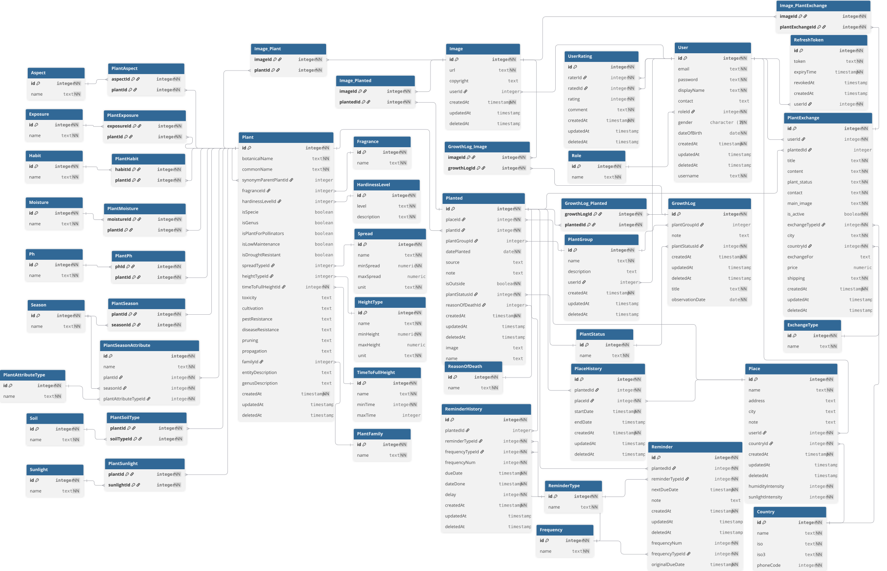
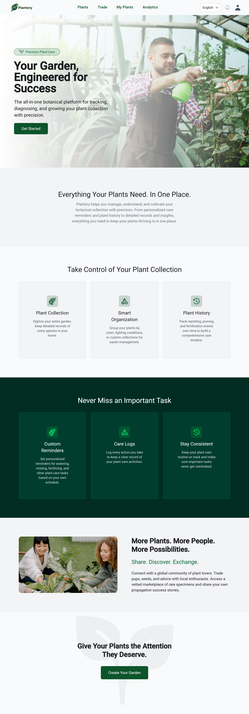
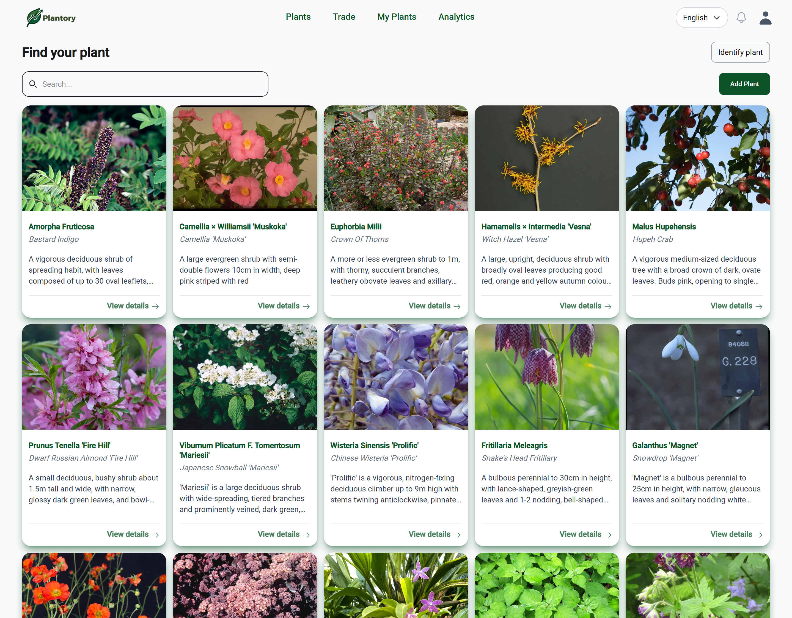
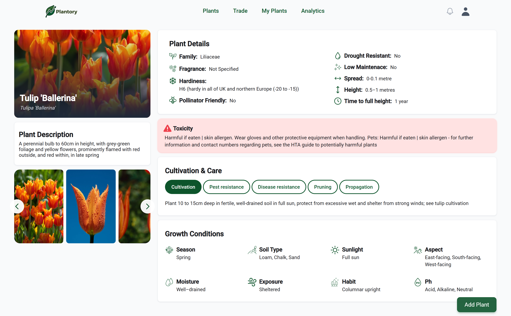
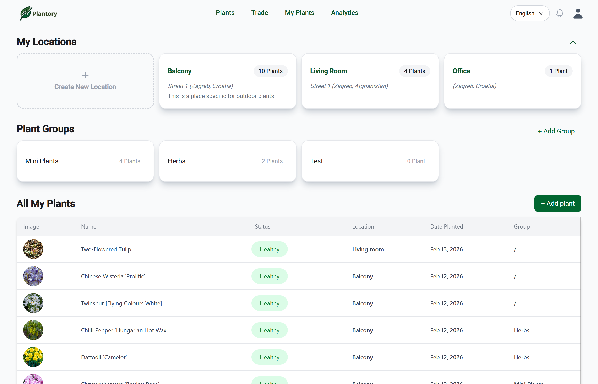
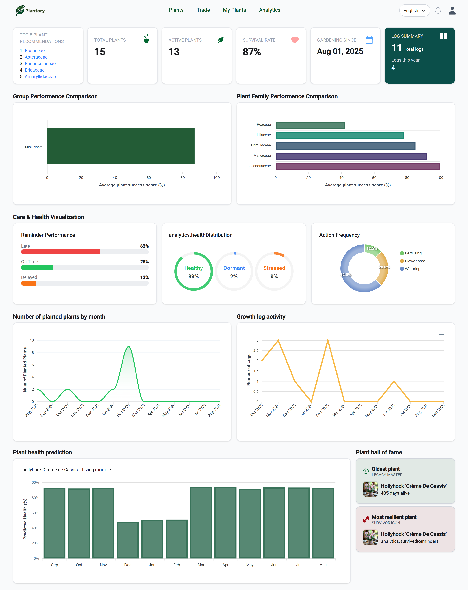

# 🌱 Plantory

### Your Garden, Engineered for Success

Plantory is a full-stack web application designed to help plant owners organize and manage their plants, track their growth and care activities, receive reminders, and discover new plants.

The application combines a **digital garden, plant catalog, analytics, machine learning, and plant exchange platform** in one place.

---

## Features

### Digital Garden

* Add and manage personal plants
* Track plant information and care
* Organize plants into groups
* View individual plant details

### Plant Catalog

* Explore a catalog of approximately **60,000 plants**
* Search and browse plant information
* View growing requirements such as sunlight and humidity

### Growth & History

* Record plant growth over time
* Track care activities
* View historical plant data and progress

### Reminders

* Create reminders for plant care
* Mark reminders as completed or postponed

### Machine Learning

* Predict plant health using **ML.NET**
* Personalized plant recommendations using **Matrix Factorization**
* Leaf disease classification using a **PyTorch** model
* Disease categories include:

  * Healthy
  * Pest
  * Virus
  * Fungus
  * Bacteria

### Plant Identification

Identify plants using image recognition through the **PlantNet API**.

### Plant Exchange

Users can:

* Sell plants
* Exchange plants
* Give plants away
* Leave and read reviews

### Image Storage

Plant images are stored using **Appwrite**.

### Authentication & Authorization

* JWT-based authentication
* Short-lived access tokens
* Refresh tokens stored in **HttpOnly cookies**
* Role-based authorization
* User and Admin roles

### Localization

* 🇭🇷 Croatian
* 🇬🇧 English

---

## Database Design

The application uses PostgreSQL as its relational database.

The database was designed using a Code First approach with Entity Framework Core.



---

## 🛠️ Tech Stack

### Frontend

* **Angular 21**
* **TypeScript**
* **HTML5**
* **Tailwind CSS**
* **ngx-translate**

Angular features used throughout the application include:

* Signals
* Route Guards
* HTTP Interceptors
* Resolvers
* Reactive forms

### Backend

* **.NET 10**
* **ASP.NET Core Web API**
* **C#**
* **Entity Framework Core**
* **PostgreSQL**

The backend follows a layered structure separating:

* Data
* Domain
* Machine Learning
* API

### Machine Learning

* **ML.NET**
* **Python**
* **PyTorch**
* **Matrix Factorization**
* Plant disease classification

### Database & Storage

* **PostgreSQL**
* **Neon**
* **Docker** (local development)
* **Appwrite** (image storage)

### APIs & Documentation

* **PlantNet API**
* **Scalar**
* **OpenAPI / Swagger**

### Deployment

* **Vercel** – Frontend
* **Azure App Service** – Backend
* **Neon** – PostgreSQL database

### Development Tools

* Git
* GitHub
* Visual Studio
* Visual Studio Code
* Docker

---

## Project Structure

```text
PlantApp/
│
├── Backend/
│   ├── PlantApp.Data/
│   │   └── Database configuration and EF Core
│   │
│   ├── PlantApp.Domain/
│   │   └── Domain entities and business models
│   │
│   ├── PlantApp.ML/
│   │   └── Machine learning functionality
│   │
│   └── PlantBackend/
│       └── ASP.NET Core Web API
│
├── Frontend/
│   └── Angular frontend
│
└── python_api/
    └── Python API for plant disease classification
```

---

## Authentication

Plantory uses JWT-based authentication with:

* Access tokens with a short lifetime
* Refresh tokens stored in HttpOnly cookies
* Secure token refresh flow
* Role-based authorization

The frontend uses an HTTP interceptor to automatically handle authentication-related requests.

---

## Machine Learning

Plantory integrates several machine learning components.

### Plant Health Prediction

An **ML.NET** model is used to estimate plant health based on available plant and care data.

### Plant Recommendations

A **Matrix Factorization** model provides personalized plant recommendations based on user interactions.

### Disease Classification

A separate **PyTorch** model analyzes plant leaf images and classifies them into one of several health or disease categories.

```text
Leaf Image
    ↓
PyTorch Model
    ↓
Classification
    ↓
Healthy / Pest / Virus / Fungus / Bacteria
```

---

## Getting Started

### Prerequisites

Make sure you have installed:

* [.NET SDK](https://dotnet.microsoft.com/)
* [Node.js](https://nodejs.org/)
* Angular CLI
* PostgreSQL or Docker
* Git

### 1. Clone the repository

```bash
git clone https://github.com/KristinaAnicic/plantApp.git

cd plantApp
```

### 2. Configure the backend

Create the required configuration/environment variables for:

* PostgreSQL connection
* JWT authentication
* Refresh token configuration
* Appwrite
* PlantNet API
* Machine learning services

### 3. Start the backend

```bash
dotnet restore
dotnet run
```

### 4. Start the frontend

```bash
npm install
ng serve
```

The Angular application will then be available locally through the development server.

---

## Screenshots

### Home Page



### Plant Catalog



### Plant Details



### My Collection



### Analytics



---


## Academic Project

Plantory was developed as a **thesis project** as part of the graduate study program *Software Engineering of Computer and Embedded Systems* at the Zagreb University of Applied Sciences (TVZ).

The project was developed as a full-stack application with an emphasis on:

* Web application development
* REST API design
* Database design
* Authentication and authorization
* Machine learning integration
* Cloud deployment

---

## Future Improvements

Possible future improvements include:

* Push notifications for plant reminders
* More advanced plant-care analytics
* Expanded machine learning capabilities
* Additional plant disease categories
* More social and community features
* Improved recommendation models

---

## License

This project was developed for academic purposes.

---

🌱 **Plantory — Your Garden, Engineered for Success**
